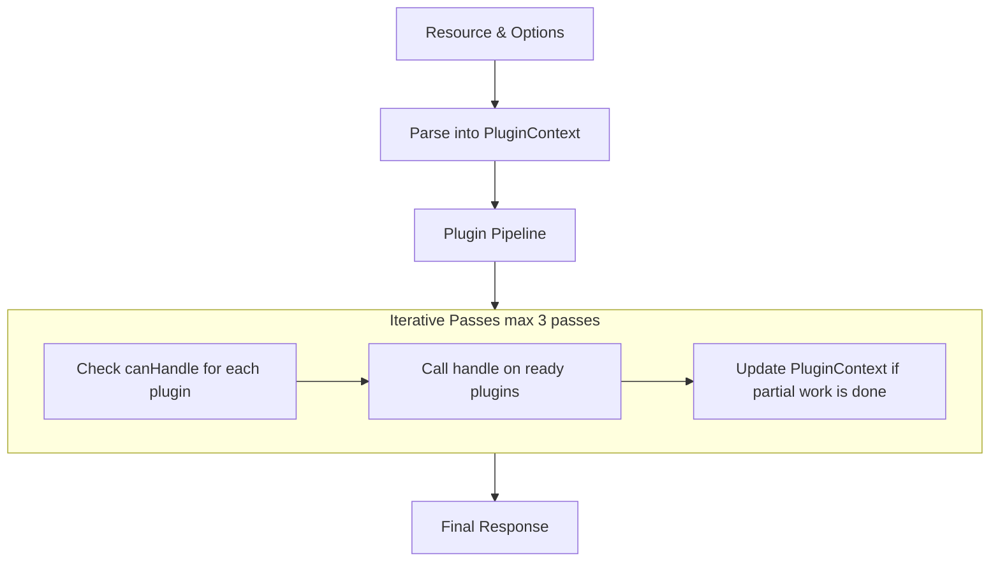

# Verified Fetch Plugins

## Plugin Interface

Each plugin must implement two methods:

- **`canHandle(context: PluginContext): boolean`**
  Inspects the current `PluginContext` (which includes the CID, path, query, accept header, etc.)
  and returns `true` if the plugin can operate on the current state of the request.

- **`handle(context: PluginContext): Promise<Response | null>`**
  Performs the plugin’s work. It may:
  - **Return a final `Response`**: This stops the pipeline immediately.
  - **Return `null`**: This indicates that the plugin has only partially processed the request
    (for example, by performing path walking or decoding) and the pipeline should continue.
  - **Throw a `PluginError`**: This logs a non-fatal error and continues the pipeline.
  - **Throw a `PluginFatalError`**: This logs a fatal error and stops the pipeline immediately.

## Plugin Pipeline

Plugins are executed in a chain (a **plugin pipeline**):

1. **Initialization:**
   - The `VerifiedFetch` class is instantiated with a list of plugins.
   - When a request is made via the `fetch` method, the resource and options are parsed to
     create a mutable `PluginContext` object.

2. **Pipeline Execution:**

   - The pipeline repeatedly checks, up to a maximum number of passes (default = 3), which plugins
     are currently able to handle the request by calling each plugin’s `canHandle()` method.
   - Plugins that have not yet been called in the current run and return `true` for `canHandle()`
     are invoked in sequence.
     - If a plugin returns a final `Response` or throws a `PluginFatalError`, the pipeline immediately
       stops and that response is returned.
     - If a plugin returns `null`, it may have updated the context (for example, by
       performing path walking), other plugins that said they `canHandle` will run.
   - If no plugin modifies the context (i.e. no change to `context.modified`) and no final response is
     produced after iterating through all plugins, the pipeline exits and a default “Not Supported”
     response is returned.

   **Diagram of the Plugin Pipeline:**



3. **Finalization:**
   - After the pipeline completes, the resulting response & context is processed (e.g. headers such as ETag,
     Cache‑Control, and Content‑Disposition are set) and returned.

Please see the original discussion on extensibility in [Issue #167](https://github.com/ipfs/helia-verified-fetch/issues/167).

***

<!-- ### Non-default plugins provided by this library

#### `dir-index-html-plugin`

This plugin is used to serve dag-pb/unixfs without an `index.html` child as HTML directory listing of the content requested.

## Example - - Using the dir-index-html-plugin

```typescript
import { createVerifiedFetch } from '@helia/verified-fetch'
import { dirIndexHtmlPluginFactory } from '@helia/verified-fetch/plugins'
import { createHelia } from 'helia'

const helia = await createHelia()
const fetch = await createVerifiedFetch(helia, {
  plugins: [dirIndexHtmlPluginFactory]
})
```

#### `dag-cbor-html-preview-plugin`

This plugin is used to serve the requested dag-cbor object as HTML when the Accept header includes `text/html`.

## Example - - Using the dag-cbor-html-preview-plugin

```typescript
import { createVerifiedFetch } from '@helia/verified-fetch'
import { dagCborHtmlPreviewPluginFactory } from '@helia/verified-fetch/plugins'
import { createHelia } from 'helia'

const helia = await createHelia()
const fetch = await createVerifiedFetch(helia, {
  plugins: [dagCborHtmlPreviewPluginFactory]
})
``` -->

### Extending Verified‑Fetch with Custom Plugins

To add your own plugin:

1. **Extend the BasePlugin:**

   Create a new class that extends `BasePlugin` and implements:

   - `canHandle(context: PluginContext): boolean`
   - `handle(context: PluginContext): Promise<Response | null>`

## Example - custom plugin

```typescript
   import { BasePlugin } from '@helia/verified-fetch'
   import type { PluginContext, VerifiedFetchPluginFactory, PluginOptions } from '@helia/verified-fetch'

   export class MyCustomPlugin extends BasePlugin {
     id = 'my-custom-plugin' // Required: must be unique unless you want to override one of the default plugins.

     // Optionally, list any codec codes your plugin supports:
     codes = [] //

     canHandle(context: PluginContext): boolean {
       // Only handle requests if the Accept header matches your custom type
       // Or check context for pathDetails, custom values, etc...
       return context.accept === 'application/vnd.my-custom-type'
     }

     async handle(context: PluginContext): Promise<Response | null> {
       // Perform any partial processing here, e.g., modify the context:
       context.customProcessed = true;

       // If you are ready to finalize the response:
       return new Response('Hello, world!', {
         status: 200,
         headers: {
           'Content-Type': 'text/plain'
         }
       });

       // Or, if further processing is needed by another plugin, simply return null.
     }
   }
   export const myCustomPluginFactory: VerifiedFetchPluginFactory = (opts: PluginOptions) => new MyCustomPlugin(opts)
```

2. **Integrate Your Plugin:**

   Add your custom plugin to Verified‑Fetch’s plugin list when instantiating Verified‑Fetch:

## Example - Integrate custom plugin

```typescript
   import { createVerifiedFetch, type VerifiedFetchPluginFactory } from '@helia/verified-fetch'
   import { createHelia } from 'helia'

   const helia = await createHelia()
   const plugins: VerifiedFetchPluginFactory[] = [
     // myCustomPluginFactory
   ]

   const fetch = await createVerifiedFetch(helia, { plugins })
```

***

### Error Handling in the Plugin Pipeline

Verified‑Fetch distinguishes between two types of errors thrown by plugins:

- **PluginError (Non‑Fatal):**
  - Use this when your plugin encounters an issue that should be logged but does not prevent the pipeline
    from continuing.
  - When a plugin throws a `PluginError`, the error is logged and the pipeline continues with the next plugin.

- **PluginFatalError (Fatal):**
  - Use this when a critical error occurs that should immediately abort the request.
  - When a plugin throws a `PluginFatalError`, the pipeline immediately terminates and the provided error
    response is returned.

## Example - Plugin error Handling

```typescript
import { PluginError, PluginFatalError } from '@helia/verified-fetch'

// async handle(context: PluginContext): Promise<Response | null> {
const recoverable = Math.random() > 0.5 // Use more sophisticated logic here ;)
if (recoverable === true) {
  throw new PluginError('MY_CUSTOM_WARNING', 'A non‑fatal issue occurred', {
    details: {
      someKey: 'Additional details here'
    }
  });
}

if (recoverable === false) {
  throw new PluginFatalError('MY_CUSTOM_FATAL', 'A critical error occurred', {
    response: new Response('Something happened', { status: 500 })  // Required: supply your own error response
  });
}

  // Otherwise, continue processing...
// }
```

### How the Plugin Pipeline Works

- **Shared Context:**
  A mutable `PluginContext` is created for each request. It includes the parsed CID, path, query parameters,
  accept header, and any other metadata. Plugins can update this context as they perform partial work (for example,
  by doing path walking or decoding).

- **Iterative Processing:**
  The pipeline repeatedly checks which plugins can currently handle the request by calling `canHandle(context)`.
  - Plugins that perform partial processing update the context and return `null`, allowing subsequent passes by other plugins.
  - Once a plugin is ready to finalize the response, it returns a final `Response` and the pipeline terminates.

- **No Strict Ordering:**
  Plugins are invoked based solely on whether they can handle the current state of the context.
  This means you do not have to specify a rigid order, each plugin simply checks the context and acts if appropriate.

- **Error Handling:**
  - A thrown `PluginError` is considered non‑fatal and is logged, allowing the pipeline to continue.
  - A thrown `PluginFatalError` immediately stops the pipeline and returns the error response.

For a detailed explanation of the pipeline, please refer to the discussion in [Issue #167](https://github.com/ipfs/helia-verified-fetch/issues/167).
