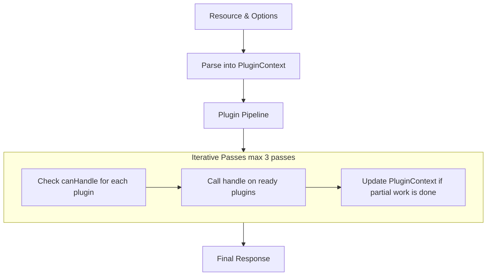

<p align="center">
  <a href="https://github.com/ipfs/helia" title="Helia">
    
  </a>
</p>

# @helia/verified-fetch

[](https://ipfs.tech)
[](https://discuss.ipfs.tech)
[](https://codecov.io/gh/ipfs/helia-verified-fetch)
[](https://github.com/ipfs/helia-verified-fetch/actions/workflows/js-test-and-release.yml?query=branch%3Amain)

> A fetch-like API for obtaining verified & trustless IPFS content on the web

# About

<!--

!IMPORTANT!

Everything in this README between "# About" and "# Install" is automatically
generated and will be overwritten the next time the doc generator is run.

To make changes to this section, please update the @packageDocumentation section
of src/index.js or src/index.ts

To experiment with formatting, please run "npm run docs" from the root of this
repo and examine the changes made.

-->

`@helia/verified-fetch` provides a [fetch](https://developer.mozilla.org/en-US/docs/Web/API/Fetch_API)-like API for retrieving content from the [IPFS](https://ipfs.tech/) network.

All content is retrieved in a [trustless manner](https://www.techopedia.com/definition/trustless), and the integrity of all bytes are verified by comparing hashes of the data.

By default, providers for CIDs are found using [delegated routing endpoints](https://docs.ipfs.tech/concepts/public-utilities/#delegated-routing).

Data is retrieved using the following strategies:

- Directly from providers, using [Bitswap](https://docs.ipfs.tech/concepts/bitswap/) over WebSockets and WebRTC if available.
- Directly from providers exposing a [trustless gateway](https://specs.ipfs.tech/http-gateways/trustless-gateway/) over HTTPS.
- As a fallback, if no providers reachable from a browser are found, data is retrieved using recursive gateways, e.g. `trustless-gateway.link` which can be configured.

This is a marked improvement over `fetch` which offers no such protections and is vulnerable to all sorts of attacks like [Content Spoofing](https://owasp.org/www-community/attacks/Content_Spoofing), [DNS Hijacking](https://en.wikipedia.org/wiki/DNS_hijacking), etc.

A `verifiedFetch` function is exported to get up and running quickly, and a `createVerifiedFetch` function is also available that allows customizing the underlying [Helia](https://ipfs.github.io/helia/) node for complete control over how content is retrieved.

Browser-cache-friendly [Response](https://developer.mozilla.org/en-US/docs/Web/API/Response) objects are returned which should be instantly familiar to web developers.

Learn more in the [announcement blog post](https://blog.ipfs.tech/verified-fetch/) and check out the [ready-to-run example](https://github.com/ipfs-examples/helia-examples/tree/main/examples/helia-browser-verified-fetch).

You may use any supported resource argument to fetch content:

- [CID](https://multiformats.github.io/js-multiformats/classes/cid.CID.html) instance
- IPFS URL
- IPNS URL

## Example - Getting started

```typescript
import { verifiedFetch } from '@helia/verified-fetch'

const resp = await verifiedFetch('ipfs://bafy...')

const json = await resp.json()
```

## Example - Using a CID instance to fetch JSON

```typescript
import { verifiedFetch } from '@helia/verified-fetch'
import { CID } from 'multiformats/cid'

const cid = CID.parse('bafyFoo') // some json file
const response = await verifiedFetch(cid)
const json = await response.json()
```

## Example - Using IPFS protocol to fetch an image

```typescript
import { verifiedFetch } from '@helia/verified-fetch'

const response = await verifiedFetch('ipfs://bafyFoo') // CID for some image file
const blob = await response.blob()
const image = document.createElement('img')
image.src = URL.createObjectURL(blob)
document.body.appendChild(image)
```

## Example - Using IPNS protocol to stream a big file

```typescript
import { verifiedFetch } from '@helia/verified-fetch'

const response = await verifiedFetch('ipns://mydomain.com/path/to/very-long-file.log')
const bigFileStreamReader = await response.body?.getReader()
```

## Configuration

### Custom HTTP gateways and routers

Out of the box `@helia/verified-fetch` uses a default set of [trustless gateways](https://specs.ipfs.tech/http-gateways/trustless-gateway/) for fetching blocks and [HTTP delegated routers](https://specs.ipfs.tech/routing/http-routing-v1/) for performing routing tasks - looking up peers, resolving/publishing [IPNS](https://docs.ipfs.tech/concepts/ipns/) names, etc.

It's possible to override these by passing `gateways` and `routers` keys to the `createVerifiedFetch` function:

## Example - Configuring gateways and routers

```typescript
import { createVerifiedFetch } from '@helia/verified-fetch'

const fetch = await createVerifiedFetch({
  gateways: ['https://trustless-gateway.link'],
  routers: ['http://delegated-ipfs.dev']
})

const resp = await fetch('ipfs://bafy...')

const json = await resp.json()
```

### Usage with customized Helia

For full control of how `@helia/verified-fetch` fetches content from the distributed web you can pass a preconfigured Helia node to `createVerifiedFetch`.

The [helia](https://www.npmjs.com/package/helia) module is configured with a libp2p node that is suited for decentralized applications, alternatively [@helia/http](https://www.npmjs.com/package/@helia/http) is available which uses HTTP gateways for all network operations.

You can see variations of Helia and js-libp2p configuration options at <https://ipfs.github.io/helia/interfaces/helia.HeliaInit.html>.

```typescript
import { trustlessGateway } from '@helia/block-brokers'
import { createHeliaHTTP } from '@helia/http'
import { delegatedHTTPRouting, httpGatewayRouting } from '@helia/routers'
import { createVerifiedFetch } from '@helia/verified-fetch'

const fetch = await createVerifiedFetch(
  await createHeliaHTTP({
    blockBrokers: [
      trustlessGateway()
    ],
    routers: [
      delegatedHTTPRouting('http://delegated-ipfs.dev'),
      httpGatewayRouting({
        gateways: ['https://mygateway.example.net', 'https://trustless-gateway.link']
      })
    ]
  })
)

const resp = await fetch('ipfs://bafy...')

const json = await resp.json()
```

### Custom content-type parsing

By default, if the response can be parsed as JSON, `@helia/verified-fetch` sets the `Content-Type` header as `application/json`, otherwise it sets it as `application/octet-stream` - this is because the `.json()`, `.text()`, `.blob()`, and `.arrayBuffer()` methods will usually work as expected without a detailed content type.

If you require an accurate content-type you can provide a `contentTypeParser` function as an option to `createVerifiedFetch` to handle parsing the content type.

The function you provide will be called with the first chunk of bytes from the file and should return a string or a promise of a string.

## Example - Customizing content-type parsing

```typescript
import { createVerifiedFetch } from '@helia/verified-fetch'
import { fileTypeFromBuffer } from 'file-type'

const fetch = await createVerifiedFetch({
  gateways: ['https://trustless-gateway.link'],
  routers: ['http://delegated-ipfs.dev']
}, {
  contentTypeParser: async (bytes) => {
    // call to some magic-byte recognition library like magic-bytes, file-type, or your own custom byte recognition
    const result = await fileTypeFromBuffer(bytes)
    return result?.mime
  }
})
```

### Custom DNS resolvers

If you don't want to leak DNS queries to the default resolvers, you can provide your own list of DNS resolvers to `createVerifiedFetch`.

Note that you do not need to provide both a DNS-over-HTTPS and a DNS-over-JSON resolver, and you should prefer `dnsJsonOverHttps` resolvers for usage in the browser for a smaller bundle size. See <https://github.com/ipfs/helia/tree/main/packages/ipns#example---using-dns-json-over-https> for more information.

## Example - Customizing DNS resolvers

```typescript
import { createVerifiedFetch } from '@helia/verified-fetch'
import { dnsJsonOverHttps, dnsOverHttps } from '@multiformats/dns/resolvers'

const fetch = await createVerifiedFetch({
  gateways: ['https://trustless-gateway.link'],
  routers: ['http://delegated-ipfs.dev'],
  dnsResolvers: [
    dnsJsonOverHttps('https://my-dns-resolver.example.com/dns-json'),
    dnsOverHttps('https://my-dns-resolver.example.com/dns-query')
  ]
})
```

## Example - Customizing DNS per-TLD resolvers

DNS resolvers can be configured to only service DNS queries for specific
TLDs:

```typescript
import { createVerifiedFetch } from '@helia/verified-fetch'
import { dnsJsonOverHttps, dnsOverHttps } from '@multiformats/dns/resolvers'

const fetch = await createVerifiedFetch({
  gateways: ['https://trustless-gateway.link'],
  routers: ['http://delegated-ipfs.dev'],
  dnsResolvers: {
    // this resolver will only be used for `.com` domains (note - this could
    // also be an array of resolvers)
    'com.': dnsJsonOverHttps('https://my-dns-resolver.example.com/dns-json'),
    // this resolver will be used for everything else (note - this could
    // also be an array of resolvers)
    '.': dnsOverHttps('https://my-dns-resolver.example.com/dns-query')
  }
})
```

### Custom Hashers

By default, `@helia/verified-fetch` supports `sha256`, `sha512`, and `identity` hashers.

If you need to use a different hasher, you can provide a [custom `hasher` function](https://multiformats.github.io/js-multiformats/interfaces/hashes_interface.MultihashHasher.html) as an option to `createVerifiedFetch`.

## Example - Passing a custom hashing function

```typescript
import { createVerifiedFetch } from '@helia/verified-fetch'
import { blake2b256 } from '@multiformats/blake2/blake2b'

const verifiedFetch = await createVerifiedFetch({
  gateways: ['https://ipfs.io'],
  hashers: [blake2b256]
})

const resp = await verifiedFetch('ipfs://cid-using-blake2b256')
```

### IPLD codec handling

IPFS supports several data formats (typically referred to as codecs) which are included in the CID. `@helia/verified-fetch` attempts to abstract away some of the details for easier consumption.

#### DAG-PB

[DAG-PB](https://ipld.io/docs/codecs/known/dag-pb/) is the codec we are most likely to encounter, it is what [UnixFS](https://github.com/ipfs/specs/blob/main/UNIXFS.md) uses under the hood.

##### Using the DAG-PB codec as a Blob

```typescript
import { verifiedFetch } from '@helia/verified-fetch'

const res = await verifiedFetch('ipfs://Qmfoo')
const blob = await res.blob()

console.info(blob) // Blob { size: x, type: 'application/octet-stream' }
```

##### Using the DAG-PB codec as an ArrayBuffer

```typescript
import { verifiedFetch } from '@helia/verified-fetch'

const res = await verifiedFetch('ipfs://Qmfoo')
const buf = await res.arrayBuffer()

console.info(buf) // ArrayBuffer { [Uint8Contents]: < ... >, byteLength: x }
```

##### Using the DAG-PB codec as a stream

```typescript
import { verifiedFetch } from '@helia/verified-fetch'

const res = await verifiedFetch('ipfs://Qmfoo')
const reader = res.body?.getReader()

if (reader == null) {
  throw new Error('Could not create reader from response body')
}

while (true) {
  const next = await reader.read()

  if (next?.done === true) {
    break
  }

  if (next?.value != null) {
    console.info(next.value) // Uint8Array(x) [ ... ]
  }
}
```

##### Content-Type

When fetching `DAG-PB` data, the content type will be set to `application/octet-stream` unless a custom content-type parser is configured.

#### JSON

The JSON codec is a very simple codec, a block parseable with this codec is a JSON string encoded into a `Uint8Array`.

##### Using the JSON codec

```typescript
import * as json from 'multiformats/codecs/json'

const block = new TextEncoder().encode('{ "hello": "world" }')
const obj = json.decode(block)

console.info(obj) // { hello: 'world' }
```

##### Content-Type

When the `JSON` codec is encountered, the `Content-Type` header of the response will be set to `application/json`.

### DAG-JSON

[DAG-JSON](https://ipld.io/docs/codecs/known/dag-json/) expands on the `JSON` codec, adding the ability to contain [CID](https://docs.ipfs.tech/concepts/content-addressing/)s which act as links to other blocks, and byte arrays.

`CID`s and byte arrays are represented using special object structures with a single `"/"` property.

Using `DAG-JSON` has two important caveats:

1. Your `JSON` structure cannot contain an object with only a `"/"` property, as it will be interpreted as a special type.
2. Since `JSON` has no technical limit on number sizes, `DAG-JSON` also allows numbers larger than `Number.MAX_SAFE_INTEGER`. JavaScript requires use of `BigInt`s to represent numbers larger than this, and `JSON.parse` does not support them, so precision will be lost.

Otherwise this codec follows the same rules as the `JSON` codec.

##### Using the DAG-JSON codec

```typescript
import * as dagJson from '@ipld/dag-json'

const block = new TextEncoder().encode(`{
  "hello": "world",
  "cid": {
    "/": "baeaaac3imvwgy3zao5xxe3de"
  },
  "buf": {
    "/": {
      "bytes": "AAECAwQ"
    }
  }
}`)

const obj = dagJson.decode(block)

console.info(obj)
// {
// hello: 'world',
// cid: CID(baeaaac3imvwgy3zao5xxe3de),
// buf: Uint8Array(5) [ 0, 1, 2, 3, 4 ]
// }
```

##### Content-Type

When the `DAG-JSON` codec is encountered in the requested CID, the `Content-Type` header of the response will be set to `application/json`.

`DAG-JSON` data can be parsed from the response by using the `.json()` function, which will return `CID`s/byte arrays as plain `{ "/": ... }` objects:

```typescript
import { verifiedFetch } from '@helia/verified-fetch'
import * as dagJson from '@ipld/dag-json'

const res = await verifiedFetch('ipfs://bafyDAGJSON')

// either:
const obj = await res.json()
console.info(obj.cid) // { "/": "baeaaac3imvwgy3zao5xxe3de" }
console.info(obj.buf) // { "/": { "bytes": "AAECAwQ" } }
```

Alternatively, it can be decoded using the `@ipld/dag-json` module and the `.arrayBuffer()` method, in which case you will get `CID` objects and `Uint8Array`s:

```typescript
import { verifiedFetch } from '@helia/verified-fetch'
import * as dagJson from '@ipld/dag-json'

const res = await verifiedFetch('ipfs://bafyDAGJSON')

// or:
const obj = dagJson.decode<any>(await res.arrayBuffer())
console.info(obj.cid) // CID(baeaaac3imvwgy3zao5xxe3de)
console.info(obj.buf) // Uint8Array(5) [ 0, 1, 2, 3, 4 ]
```

#### DAG-CBOR

[DAG-CBOR](https://ipld.io/docs/codecs/known/dag-cbor/) uses the [Concise Binary Object Representation](https://cbor.io/) format for serialization instead of JSON.

This supports more data types in a safer way than JSON and is smaller on the wire to boot so is usually preferable to JSON or DAG-JSON.

##### Content-Type

Not all data types supported by `DAG-CBOR` can be successfully turned into JSON and back into the same binary form.

When a decoded block can be round-tripped to JSON, the `Content-Type` will be set to `application/json`. In this case the `.json()` method on the `Response` object can be used to obtain an object representation of the response.

When it cannot, the `Content-Type` will be `application/octet-stream` - in this case the `@ipld/dag-json` module must be used to deserialize the return value from `.arrayBuffer()`.

##### Detecting JSON-safe DAG-CBOR

If the `Content-Type` header of the response is `application/json`, the `.json()` method may be used to access the response body in object form, otherwise the `.arrayBuffer()` method must be used to decode the raw bytes using the `@ipld/dag-cbor` module.

```typescript
import { verifiedFetch } from '@helia/verified-fetch'
import * as dagCbor from '@ipld/dag-cbor'

const res = await verifiedFetch('ipfs://bafyDagCborCID')
let obj

if (res.headers.get('Content-Type') === 'application/json') {
  // DAG-CBOR data can be safely decoded as JSON
  obj = await res.json()
} else {
  // response contains non-JSON friendly data types
  obj = dagCbor.decode(await res.arrayBuffer())
}

console.info(obj) // ...
```

## The `Accept` header

The `Accept` header can be passed to override certain response processing, or to ensure that the final `Content-Type` of the response is the one that is expected.

If the final `Content-Type` does not match the `Accept` header, or if the content cannot be represented in the format dictated by the `Accept` header, or you have configured a custom content type parser, and that parser returns a value that isn't in the accept header, a [406: Not Acceptable](https://developer.mozilla.org/en-US/docs/Web/HTTP/Status/406) response will be returned:

```typescript
import { verifiedFetch } from '@helia/verified-fetch'

const res = await verifiedFetch('ipfs://bafyJPEGImageCID', {
  headers: {
    accept: 'image/png'
  }
})

console.info(res.status) // 406 - the image was a JPEG but we specified PNG as the accept header
```

It can also be used to skip processing the data from some formats such as `DAG-CBOR` if you wish to handle decoding it yourself:

```typescript
import { verifiedFetch } from '@helia/verified-fetch'

const res = await verifiedFetch('ipfs://bafyDAGCBORCID', {
  headers: {
    accept: 'application/octet-stream'
  }
})

console.info(res.headers.get('accept')) // application/octet-stream
const buf = await res.arrayBuffer() // raw bytes, not processed as JSON
```

## Redirects

If a requested URL contains a path component, that path component resolves to
a UnixFS directory, but the URL does not have a trailing slash, one will be
added to form a canonical URL for that resource, otherwise the request will
be resolved as normal.

```typescript
import { verifiedFetch } from '@helia/verified-fetch'

const res = await verifiedFetch('ipfs://bafyfoo/path/to/dir')

console.info(res.url) // ipfs://bafyfoo/path/to/dir/
```

It's possible to prevent this behavior and/or handle a redirect manually
through use of the [redirect](https://developer.mozilla.org/en-US/docs/Web/API/fetch#redirect)
option.

## Example - Redirect: follow

This is the default value and is what happens if no value is specified.

```typescript
import { verifiedFetch } from '@helia/verified-fetch'

const res = await verifiedFetch('ipfs://bafyfoo/path/to/dir', {
  redirect: 'follow'
})

console.info(res.status) // 200
console.info(res.url) // ipfs://bafyfoo/path/to/dir/
console.info(res.redirected) // true
```

## Example - Redirect: error

This causes a `TypeError` to be thrown if a URL would cause a redirect.

```typescript

import { verifiedFetch } from '@helia/verified-fetch'

const res = await verifiedFetch('ipfs://bafyfoo/path/to/dir', {
  redirect: 'error'
})
// throw TypeError('Failed to fetch')
```

## Example - Redirect: manual

Manual redirects allow the user to process the redirect. A [301](https://developer.mozilla.org/en-US/docs/Web/HTTP/Status/301)
is returned, and the location to redirect to is available as the "location"
response header.

This differs slightly from HTTP fetch which returns an opaque response as the
browser itself is expected to process the redirect and hide all details from
the user.

```typescript

import { verifiedFetch } from '@helia/verified-fetch'

const res = await verifiedFetch('ipfs://bafyfoo/path/to/dir', {
  redirect: 'manual'
})

console.info(res.status) // 301
console.info(res.url) // ipfs://bafyfoo/path/to/dir
console.info(res.redirected) // false
console.info(res.headers.get('location')) // ipfs://bafyfoo/path/to/dir/
```

## Comparison to fetch

This module attempts to act as similarly to the `fetch()` API as possible.

[The `fetch()` API](https://developer.mozilla.org/en-US/docs/Web/API/fetch) takes two parameters:

1. A [resource](https://developer.mozilla.org/en-US/docs/Web/API/fetch#resource)
2. An [options object](https://developer.mozilla.org/en-US/docs/Web/API/fetch#options)

### Resource argument

This library supports the following methods of fetching web3 content from IPFS:

1. IPFS protocol: `ipfs://<cidv0>` & `ipfs://<cidv1>`
2. IPNS protocol: `ipns://<peerId>` & `ipns://<publicKey>` & `ipns://<hostUri_Supporting_DnsLink_TxtRecords>`
3. CID instances: An actual CID instance `CID.parse('bafy...')`

As well as support for pathing & params for items 1 & 2 above according to [IPFS - Path Gateway Specification](https://specs.ipfs.tech/http-gateways/path-gateway) & [IPFS - Trustless Gateway Specification](https://specs.ipfs.tech/http-gateways/trustless-gateway/). Further refinement of those specifications specifically for web-based scenarios can be found in the [Web Pathing Specification IPIP](https://github.com/ipfs/specs/pull/453).

If you pass a CID instance, it assumes you want the content for that specific CID only, and does not support pathing or params for that CID.

### Options argument

This library does not plan to support the exact Fetch API options object, as some of the arguments don't make sense. Instead, it will only support options necessary to meet [IPFS specs](https://specs.ipfs.tech/) related to specifying the resultant shape of desired content.

Some of those header specifications are:

1. <https://specs.ipfs.tech/http-gateways/path-gateway/#request-headers>
2. <https://specs.ipfs.tech/http-gateways/trustless-gateway/#request-headers>
3. <https://specs.ipfs.tech/http-gateways/subdomain-gateway/#request-headers>

Where possible, options and Helia internals will be automatically configured to the appropriate codec & content type based on the `verified-fetch` configuration and `options` argument passed.

Known Fetch API options that will be supported:

1. `signal` - An AbortSignal that a user can use to abort the request.
2. `redirect` - A string that specifies the redirect type. One of `follow`, `error`, or `manual`. Defaults to `follow`. Best effort to adhere to the [Fetch API redirect](https://developer.mozilla.org/en-US/docs/Web/API/fetch#redirect) parameter.
3. `headers` - An object of headers to be sent with the request. Best effort to adhere to the [Fetch API headers](https://developer.mozilla.org/en-US/docs/Web/API/fetch#headers) parameter.
   - `accept` - A string that specifies the accept header. Relevant values:
     - [`vnd.ipld.raw`](https://www.iana.org/assignments/media-types/application/vnd.ipld.raw). (default)
     - [`vnd.ipld.car`](https://www.iana.org/assignments/media-types/application/vnd.ipld.car)
     - [`vnd.ipfs.ipns-record`](https://www.iana.org/assignments/media-types/application/vnd.ipfs.ipns-record)
4. `method` - A string that specifies the HTTP method to use for the request. Defaults to `GET`. Best effort to adhere to the [Fetch API method](https://developer.mozilla.org/en-US/docs/Web/API/fetch#method) parameter.
5. `body` - An object that specifies the body of the request. Best effort to adhere to the [Fetch API body](https://developer.mozilla.org/en-US/docs/Web/API/fetch#body) parameter.
6. `cache` - Will basically act as `force-cache` for the request. Best effort to adhere to the [Fetch API cache](https://developer.mozilla.org/en-US/docs/Web/API/fetch#cache) parameter.

Non-Fetch API options that will be supported:

1. `onProgress` - Similar to Helia `onProgress` options, this will be a function that will be called with a progress event. Supported progress events are:
   - `helia:verified-fetch:error` - An error occurred during the request.
   - `helia:verified-fetch:request:start` - The request has been sent
   - `helia:verified-fetch:request:complete` - The request has been sent
   - `helia:verified-fetch:request:error` - An error occurred during the request.
   - `helia:verified-fetch:request:abort` - The request was aborted prior to completion.
   - `helia:verified-fetch:response:start` - The initial HTTP Response headers have been set, and response stream is started.
   - `helia:verified-fetch:response:complete` - The response stream has completed.
   - `helia:verified-fetch:response:error` - An error occurred while building the response.

Some in-flight specs (IPIPs) that will affect the options object this library supports in the future can be seen at <https://specs.ipfs.tech/ipips>, a subset are:

1. [IPIP-0412: Signaling Block Order in CARs on HTTP Gateways](https://specs.ipfs.tech/ipips/ipip-0412/)
2. [IPIP-0402: Partial CAR Support on Trustless Gateways](https://specs.ipfs.tech/ipips/ipip-0402/)
3. [IPIP-0386: Subdomain Gateway Interop with \_redirects](https://specs.ipfs.tech/ipips/ipip-0386/)
4. [IPIP-0328: JSON and CBOR Response Formats on HTTP Gateways](https://specs.ipfs.tech/ipips/ipip-0328/)
5. [IPIP-0288: TAR Response Format on HTTP Gateways](https://specs.ipfs.tech/ipips/ipip-0288/)

### Response types

This library's purpose is to return reasonably representable content from IPFS. In other words, fetching content is intended for leaf-node content -- such as images/videos/audio & other assets, or other IPLD content (with link) -- that can be represented by <https://developer.mozilla.org/en-US/docs/Web/API/Response#instance_methods>. The content type you receive back will depend upon the CID you request as well as the `Accept` header value you provide.

All content we retrieve from the IPFS network is obtained via an AsyncIterable, and will be set as the [body of the HTTP Response](https://developer.mozilla.org/en-US/docs/Web/API/Response/Response#body) via a [`ReadableStream`](https://developer.mozilla.org/en-US/docs/Web/API/Streams_API/Using_readable_streams#consuming_a_fetch_as_a_stream) or other efficient method that avoids loading the entire response into memory or getting the entire response from the network before returning a response to the user.

If your content doesn't have a mime-type or an [IPFS spec](https://specs.ipfs.tech), this library will not support it, but you can use the [`helia`](https://github.com/ipfs/helia) library directly for those use cases. See [Unsupported response types](#unsupported-response-types) for more information.

#### Handling response types

For handling responses we want to follow conventions/abstractions from Fetch API where possible:

- For JSON, assuming you abstract any differences between dag-json/dag-cbor/json/and json-file-on-unixfs, you would call `.json()` to get a JSON object.
- For images (or other web-relevant asset) you want to add to the DOM, use `.blob()` or `.arrayBuffer()` to get the raw bytes.
- For plain text in utf-8, you would call `.text()`
- For streaming response data, use something like `response.body.getReader()` to get a [`ReadableStream`](https://developer.mozilla.org/en-US/docs/Web/API/Streams_API/Using_readable_streams#consuming_a_fetch_as_a_stream).

#### Unsupported response types

- Returning IPLD nodes or DAGs as JS objects is not supported, as there is no currently well-defined structure for representing this data in an [HTTP Response](https://developer.mozilla.org/en-US/docs/Web/API/Response). Instead, users should request `aplication/vnd.ipld.car` or use the [`helia`](https://github.com/ipfs/helia) library directly for this use case.
- Others? Open an issue or PR!

### Response headers

This library will set the [HTTP Response](https://developer.mozilla.org/en-US/docs/Web/API/Response) headers to the appropriate values for the content type according to the appropriate [IPFS Specifications](https://specs.ipfs.tech/).

Some known header specifications:

- <https://specs.ipfs.tech/http-gateways/path-gateway/#response-headers>
- <https://specs.ipfs.tech/http-gateways/trustless-gateway/#response-headers>
- <https://specs.ipfs.tech/http-gateways/subdomain-gateway/#response-headers>

#### Server Timing headers

By default, we do not include [Server Timing](https://developer.mozilla.org/en-US/docs/Web/API/Performance_API/Server_timing) headers in responses. If you want to include them, you can pass an
`withServerTiming` option to the `createVerifiedFetch` function to include them in all future responses. You can
also pass the `withServerTiming` option to each fetch call to include them only for that specific response.

See PR where this was added, <https://github.com/ipfs/helia-verified-fetch/pull/164>, for more information.

### Possible Scenarios that could cause confusion

#### Attempting to fetch the CID for content that does not make sense

If you request `bafybeiaysi4s6lnjev27ln5icwm6tueaw2vdykrtjkwiphwekaywqhcjze`, which points to the root of the en.wikipedia.org mirror, a response object does not make sense.

### Errors

Known Errors that can be thrown:

1. `TypeError` - If the resource argument is not a string, CID, or CID string.
2. `TypeError` - If the options argument is passed and not an object.
3. `TypeError` - If the options argument is passed and is malformed.
4. `AbortError` - If the content request is aborted due to user aborting provided AbortSignal. Note that this is a `AbortError` from `@libp2p/interface` and not the standard `AbortError` from the Fetch API.

## Extensibility

Verified‑fetch can now be extended to alter how it handles requests by using plugins.
Plugins are classes that extend the `BasePlugin` class and implement the `VerifiedFetchPlugin`
interface. They are instantiated with `PluginOptions` when the `VerifiedFetch` class is created.

### Plugin Interface

Each plugin must implement two methods:

- **`canHandle(context: PluginContext): boolean`**
  Inspects the current `PluginContext` (which includes the CID, path, query, accept header, etc.)
  and returns `true` if the plugin can operate on the current state of the request.

- **`handle(context: PluginContext): Promise<Response | undefined>`**
  Performs the plugin’s work. It will only be executed if `canHandle` previously returned `true`.
  It may:
  - **Return a `Response`**: This stops the pipeline immediately and returns the response.
  - **Return `undefined`**: This indicates that the plugin has only partially processed the request
    (for example, by performing path walking or decoding) and the pipeline should continue.
  - **Throw an `Error`**: An Internal Server Error will be returned

### Plugin Pipeline

Plugins are executed in a chain (a **plugin pipeline**):

1. **Initialization:**
   - The `VerifiedFetch` class is instantiated with a list of plugins.
   - When a request is made via the `fetch` method, the resource and options are parsed to
     create a mutable `PluginContext` object.

2. **Pipeline Execution:**

   - The pipeline repeatedly checks, up to a maximum number of passes (default = 3), which plugins
     are currently able to handle the request by calling each plugin’s `canHandle()` method.
   - Plugins that have not yet been called in the current run and return `true` for `canHandle()`
     are invoked in sequence.
     - If a plugin returns a final `Response` or throws a `PluginFatalError`, the pipeline immediately
       stops and that response is returned.
     - If a plugin returns `null`, it may have updated the context (for example, by
       performing path walking), other plugins that said they `canHandle` will run.
   - If no plugin modifies the context (i.e. no change to `context.modified`) and no final response is
     produced after iterating through all plugins, the pipeline exits and a default “Not Supported”
     response is returned.

   **Diagram of the Plugin Pipeline:**



3. **Finalization:**
   - After the pipeline completes, the resulting response & context is processed (e.g. headers such as ETag,
     Cache‑Control, and Content‑Disposition are set) and returned.

Please see the original discussion on extensibility in [Issue #167](https://github.com/ipfs/helia-verified-fetch/issues/167).

***

### Extending Verified‑Fetch with Custom Plugins

To add your own plugin:

1. **Extend the BasePlugin:**

   Create a new class that extends `BasePlugin` and implements:

   - `canHandle(context: PluginContext): boolean`
   - `handle(context: PluginContext): Promise<Response | null>`

## Example - custom plugin

```typescript
   import { BasePlugin } from '@helia/verified-fetch'
   import type { PluginContext, VerifiedFetchPluginFactory, PluginOptions } from '@helia/verified-fetch'

   export class MyCustomPlugin extends BasePlugin {
     id = 'my-custom-plugin' // Required: must be unique unless you want to override one of the default plugins.

     // Optionally, list any codec codes your plugin supports:
     codes = [] //

     canHandle({ accept }: PluginContext): boolean {
       // Only handle requests if the Accept header matches your custom type
       // Or check context for pathDetails, custom values, etc...
       return accept.some(header => header.contentType.mediaType === 'application/vnd.my-custom-type')
     }

     async handle(context: PluginContext): Promise<Response> {
       // Return the response:
       return new Response('Hello, world!', {
         status: 200,
         headers: {
           'Content-Type': 'text/plain'
         }
       })
     }
   }
   export const myCustomPluginFactory: VerifiedFetchPluginFactory = (opts: PluginOptions) => new MyCustomPlugin(opts)
```

2. **Integrate Your Plugin:**

   Add your custom plugin to Verified‑Fetch’s plugin list when instantiating Verified‑Fetch:

## Example - Integrate custom plugin

```typescript
   import { createVerifiedFetch, type VerifiedFetchPluginFactory } from '@helia/verified-fetch'
   import { createHelia } from 'helia'

   const helia = await createHelia()
   const plugins: VerifiedFetchPluginFactory[] = [
     // myCustomPluginFactory
   ]

   const fetch = await createVerifiedFetch(helia, { plugins })
```

### How the Plugin Pipeline Works

- **Shared Context:**
  A mutable `PluginContext` is created for each request. It includes the parsed CID, path, query parameters,
  accept header, and any other metadata. Plugins can update this context as they perform partial work (for example,
  by doing path walking or decoding).

- **Iterative Processing:**
  The pipeline repeatedly checks which plugins can currently handle the request by calling `canHandle(context)`.
  - Plugins that perform partial processing update the context and return `null`, allowing subsequent passes by other plugins.
  - Once a plugin is ready to finalize the response, it returns a final `Response` and the pipeline terminates.

- **No Strict Ordering:**
  Plugins are invoked based solely on whether they can handle the current state of the context.
  This means you do not have to specify a rigid order, each plugin simply checks the context and acts if appropriate.

- **Error Handling:**
  - Any thrown error immediately stops the pipeline and returns the error response.

For a detailed explanation of the pipeline, please refer to the discussion in [Issue #167](https://github.com/ipfs/helia-verified-fetch/issues/167).

# Install

```console
$ npm i @helia/verified-fetch
```

## Browser `<script>` tag

Loading this module through a script tag will make its exports available as `HeliaVerifiedFetch` in the global namespace.

```html
<script src="https://unpkg.com/@helia/verified-fetch/dist/index.min.js"></script>
```

# API Docs

- <https://ipfs.github.io/helia-verified-fetch/modules/_helia_verified_fetch.html>

# License

Licensed under either of

- Apache 2.0, ([LICENSE-APACHE](https://github.com/ipfs/helia-verified-fetch/blob/main/packages/verified-fetch/LICENSE-APACHE) / <http://www.apache.org/licenses/LICENSE-2.0>)
- MIT ([LICENSE-MIT](https://github.com/ipfs/helia-verified-fetch/blob/main/packages/verified-fetch/LICENSE-MIT) / <http://opensource.org/licenses/MIT>)

# Contribute

Contributions welcome! Please check out [the issues](https://github.com/ipfs/helia-verified-fetch/issues).

Also see our [contributing document](https://github.com/ipfs/community/blob/master/CONTRIBUTING_JS.md) for more information on how we work, and about contributing in general.

Please be aware that all interactions related to this repo are subject to the IPFS [Code of Conduct](https://github.com/ipfs/community/blob/master/code-of-conduct.md).

Unless you explicitly state otherwise, any contribution intentionally submitted for inclusion in the work by you, as defined in the Apache-2.0 license, shall be dual licensed as above, without any additional terms or conditions.

[](https://github.com/ipfs/community/blob/master/CONTRIBUTING.md)
